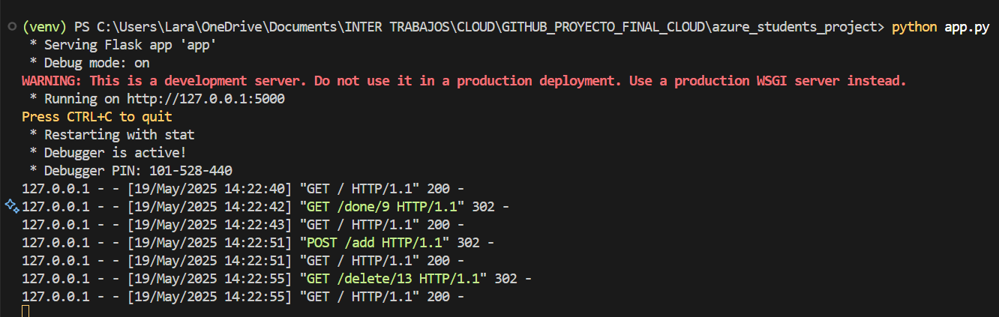
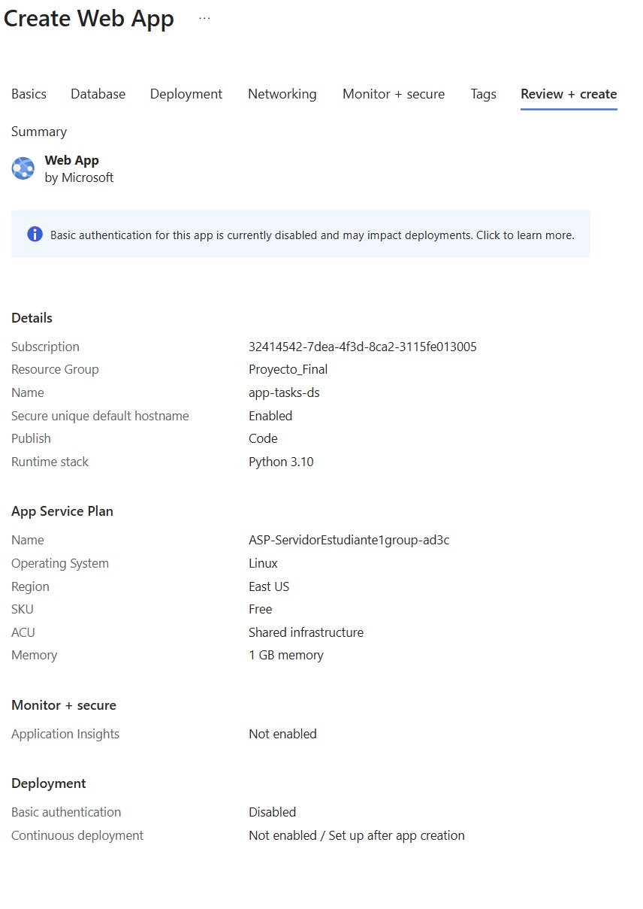
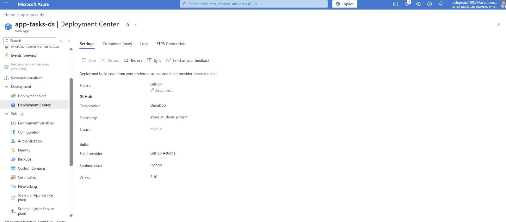
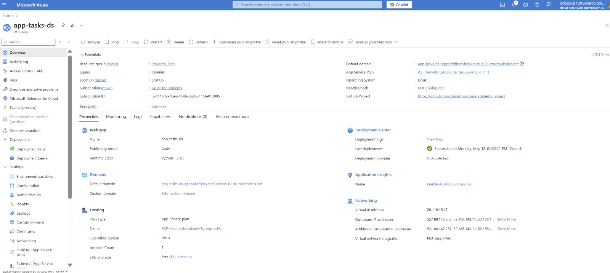
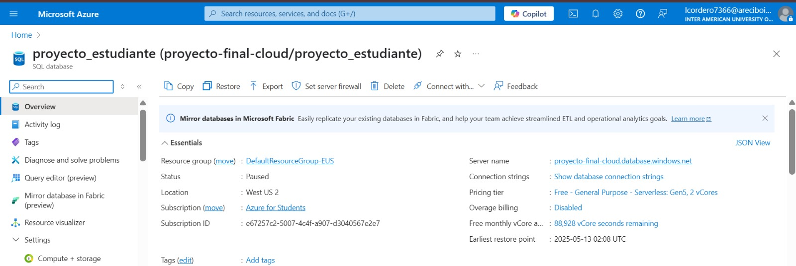
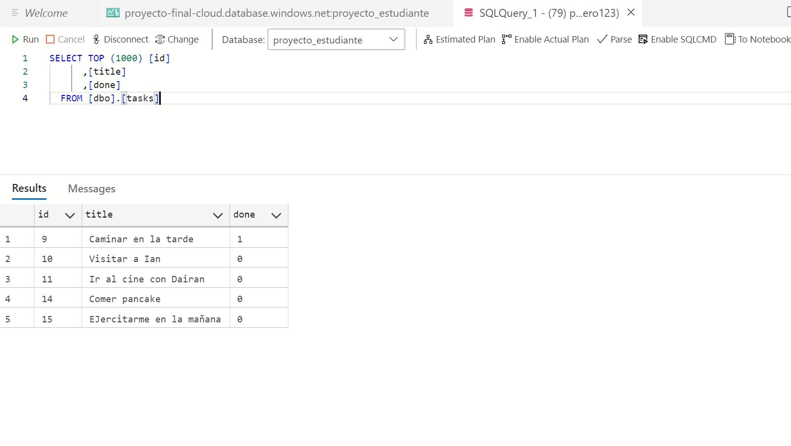
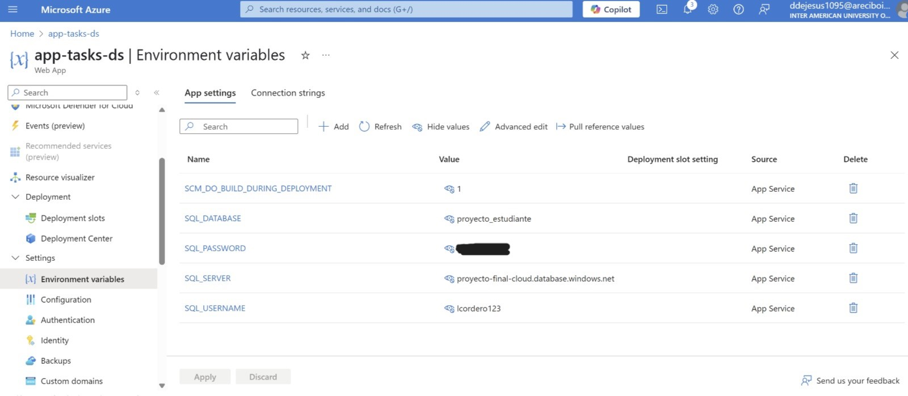
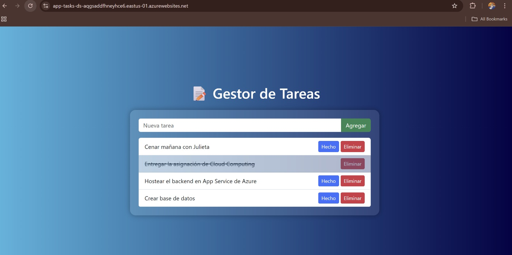

# Task Manager App

---

## 🧑‍💻 Integrantes del Equipo
- Lara V. Cordero Rodríguez - R00607366 - lcordero7366@arecibointer.edu
- Dairan S. De Jesús Mora - R00611095 - ddejesus1095@arecibointer.edu
- Ian P. Padua Cuevas -R00608377 - ipadua8377@arecibointer.edu

---

## 🎯 Descripción General
Describe brevemente tu aplicación:
- ¿Qué hace?
  El Task Manager App es una app que gestiona tareas que le provee el usuario. Donde puede crear, tachar las tareas hechas y eliminar las tareas realizadas.
- ¿A quién va dirigida?
  Esta aplición esta dirigida a usuarios como estudiantes, profesionales o personas que desean gestionar de una manera organizada y flexible.
- ¿Qué problema resuelve o qué funcionalidad ofrece?
  La aplicación está diseñada para enfrentar los desafíos relacionados con la falta de organización y el control ineficaz de tareas. Ofrece una forma clara y ordenada de gestionar actividades, optimizando el flujo de trabajo y facilitando el cumplimiento de responsabilidades diarias. 
---

## ☁️ Servicios de Azure Utilizados

| Servicio              | Propósito dentro del proyecto                                             | Gratuito en Azure for Students |
| --------------------- | ------------------------------------------------------------------------- | ------------------------------ |
| Azure App Service     | Hospedaje de la aplicación web y gestión del entorno de ejecución         | ✅ Sí                           |
| Azure SQL Database    | Almacenamiento estructurado de los datos utilizados por la app            | ✅ Sí                           |
| Azure SQL Server      | Motor de base de datos para gestionar conexiones y seguridad              | ✅ Sí                           |

--- 

## 🧱 Diagrama de Arquitectura

---

## ⚙️ Despliegue y Configuración

### 1. Preparación Local
1. Clonar el repositorio de github: https://github.com/javierdastas/comp4260
2. Configurar el entorno virtual en la terminal de Visual Studio Code `python -m venv venv`.
3. Al activar el entorno, instalas las dependencias con `pip install -r requirements.txt`.
4. Luego, configuras las variables de entorno en un `.env`
5. En la terminal de VSC se ejecuta en la terminal el comando de `python app.py`.

6. Al ejecutarse ese comando podras ver las configuraciones del "Host" y entras al puerto `http://127.0.0.1:5000`

7. Finalmente, se muestra la interfaz del Task Manager App y se nota la ruta en el browser, indicando la utilización del puerto correcto.

información Configuración en Azure Readme: 

### 🚀 2. Configuración en Azure ☁️

Este documento detalla los pasos realizados en el Azure Portal para la configuración de la aplicación web 🌐 y su conexión crucial con la base de datos Azure SQL 💾.

### 🛠️ Pasos Realizados en Azure Portal 🛠️

#### ⚙️ Configuración del App Service ⚙️

Se creó un **Web App** con los siguientes detalles clave:

* **🏷️ Nombre del Web App:** `app-tasks-ds`
* **🌍 Región:** East US
* **📂 Grupo de recursos:** `Proyecto_Final`
* **🔗 Dominio predeterminado:** `app-tasks-ds-aqgsaddfhneyhce6.eastus-01.azurewebsites.net`
* **⚙️ Plan de App Service:** `ASP-ServidorEstudiante1group-ad3c` (F1: 1)
*  **🔗 Repositorio conectado:** [https://github.com/DairaDoo/azure_students_project](https://github.com/DairaDoo/azure_students_project)

Este **Web App** servirá como la plataforma de ejecución para nuestra aplicación **Flask**.

#### 🔑 Variables de entorno definidas 🔑

Se definieron las siguientes **variables de entorno** dentro de la configuración del **App Service** para la conexión a la base de datos:

* `SQL_SERVER`
* `SQL_DATABASE`
* `SQL_USERNAME`
* `SQL_PASSWORD`

Estas variables serán utilizadas por la aplicación **Flask** para establecer una conexión segura con la base de datos **Azure SQL**.

#### 💾 Configuración del SQL Server 💾

Para la **persistencia de datos** de la aplicación, se configuró una base de datos **Azure SQL** siguiendo estos pasos esenciales:

1.  ✨ Se creó una **Azure SQL Database** con el nombre: `proyecto_estudiante`.
2.  📂 Se seleccionó o creó un **Grupo de recursos** denominado: `DefaultResourceGroup-EUS`.
3.  🌐 Se provisionó un nuevo **servidor** llamado: `proyecto-final-cloud`, ubicado en la región: `West US 2`.
4.  🛡️ Se configuró la **autenticación** del servidor mediante **Microsoft Entra ID** y una cuenta de administrador de SQL, con los siguientes detalles:
    * **👤 Nombre de administrador:** `lcordero123`
    * **🏢 Microsoft Entra ID:** `lcordero7366@arecibointer.edu`
    * **🔒 Contraseña:** (Contraseña personalizada establecida durante la creación).
5.  🚦 Se agregaron las **direcciones IPv4** necesarias a la configuración del **firewall** del servidor para permitir el acceso.
6.  ✅ Finalmente, se creó la base de datos `proyecto_estudiante` en el servidor `proyecto-final-cloud`, completando la configuración de la base de datos para nuestro proyecto.

#### 🔗 Conexión del App Service a la Base de Datos 🔗

Una vez que la base de datos estuvo operativa, se obtuvo la **cadena de conexión (connection string)** 🔑. Esta cadena se utilizó para configurar las **variables de entorno** (`SQL_SERVER`, `SQL_DATABASE`, `SQL_USERNAME`, `SQL_PASSWORD`) dentro de la configuración del **App Service**. Al establecer estas variables con los detalles de conexión correctos, la aplicación **Flask** desplegada en el **Web App** pudo establecer comunicación y realizar operaciones en la base de datos `proyecto_estudiante`.

## ⚙️ 3. Automatización: Despliegue con GitHub Actions

Este proyecto utiliza **GitHub Actions** para automatizar la construcción, validación y despliegue de una aplicación Python hacia **Azure Web App**.

### 📄 Archivo de configuración

El archivo responsable de esta automatización es:

.github/workflows/main_app-task-ds.yml

---

### 🔁 ¿Qué automatiza?

El flujo de trabajo definido en `main_app-task-ds.yml` consta de **dos fases principales**: `build` y `deploy`.

#### 🧱 Fase 1: `build`

Esta fase se ejecuta automáticamente cuando se hace `push` a la rama `main` o manualmente desde la pestaña **Actions** de GitHub. Sus pasos son los siguientes:

1. **Clona el repositorio.**
2. **Configura Python 3.10** en el entorno de ejecución.
3. **Crea y activa un entorno virtual.**
4. **Instala dependencias** desde `requirements.txt`.
5. **Instala y ejecuta Black** para verificar el formato de `app.py`.
6. **Comprime todo el proyecto** en un archivo `release.zip` (ignorando la carpeta `venv/`).
7. **Sube el artefacto comprimido** para ser utilizado posteriormente en la fase de despliegue.

#### ☁️ Fase 2: `deploy`

Esta fase se ejecuta solo si la fase `build` se completa correctamente. Aquí se realiza lo siguiente:

1. **Descarga el artefacto** generado por `build`.
2. **Descomprime** el archivo `release.zip`.
3. **Inicia sesión en Azure** usando credenciales seguras (almacenadas como `Secrets` en GitHub).
4. **Despliega automáticamente la aplicación** al recurso de Azure Web App llamado `app-tasks-ds`, en el slot `Production`.

---

### 🔐 Requisitos para la automatización

Para que esta automatización funcione correctamente, se deben configurar los siguientes **Secrets** en el repositorio de GitHub:

- `AZUREAPPSERVICE_CLIENTID_XXXX`
- `AZUREAPPSERVICE_TENANTID_XXXX`
- `AZUREAPPSERVICE_SUBSCRIPTIONID_XXXX`

Estos permiten la autenticación segura con Azure sin almacenar credenciales sensibles directamente en el código.

---

### ✅ Resultado

Al completar el flujo, cualquier cambio confirmado en la rama `main` será automáticamente:

- Validado en cuanto a formato.
- Empaquetado como artefacto listo para despliegue.
- Desplegado directamente en el entorno de producción en Azure, sin intervención manual.

---

## 💻 Enlace a la Aplicación Desplegada
> [https://app-tasks-ds-aqgsaddfhneyhce6.eastus-01.azurewebsites.net](https://app-tasks-ds-aqgsaddfhneyhce6.eastus-01.azurewebsites.net/)

---

## 💰 Estimación de Costo con Azure Pricing Calculator
Este proyecto utiliza los siguientes servicios de Azure:
- Azure SQL Database – Nombre del recurso: proyecto_estudiante
- Azure SQL Server – Nombre del recurso: proyecto-final-cloud

---

## 🧾 Plan Gratuito: Azure for Students
Azure for Students proporciona un crédito gratuito de $100 USD por 12 meses y acceso a múltiples servicios gratuitos, ideal para proyectos académicos.

| Servicio               | Detalles del Plan Gratuito                                                         |
| ---------------------- | ---------------------------------------------------------------------------------- |
| **Azure SQL Database** | Hasta 250 GB de almacenamiento con rendimiento básico (5 DTUs) por 12 meses        |
| **Azure SQL Server**   | Sin costo adicional cuando se usa con bases de datos incluidas en el plan gratuito |

✅ Mientras se mantenga dentro de estos límites, el uso es completamente gratuito.

---

## 📉 ¿Qué pasa si no se utiliza el plan gratuito?
Si no se cuenta con los beneficios del plan Azure for Students, los servicios se cobrarán bajo la estructura estándar de precios de Azure.

## 💡 Fórmula para estimar el costo mensual:
Costo mensual ≈ (Precio por nivel de rendimiento × Horas/mes) + (Precio por GB de almacenamiento × Almacenamiento)

---

## 📊 Escenario hipotético sin plan gratuito
Supongamos que tu aplicación es utilizada activamente por 500 usuarios mensuales, lo que requiere mayor rendimiento para manejar múltiples conexiones y transacciones concurrentes.

Configuración estimada para 500 usuarios:
- Azure SQL Database(DTU-based model)
- Plan: Standard – S1 (20 DTUs)
- Almacenamiento: 10 GB

- Tiempo en línea: 730 horas/mes (24/7)

- Precio aproximado: $30.72 USD/mes

- Azure SQL Server
  - Costo adicional: $0 USD (cuando se usa junto a SQL Database)

| Recurso                | Configuración                      | Precio estimado mensual |
| ---------------------- | ---------------------------------- | ----------------------- |
| **Azure SQL Database** | S1 – 20 DTUs, 10 GB almacenamiento | \~\$30.45 USD           |
| **Azure SQL Server**   | Usado junto a SQL Database         | \$0 USD                 |
| **Total estimado**     |                                    | **\~\$30.45 USD/mes**   |

> [Azure Pricing Calculator](ExportedEstimate.pdf)

---

## 📁 Capturas del Portal de Azure

## Configuraciones (Create Web App)

## Centro de Despliegue

## Overview

## SQL Overview

## SQL Tables

## Variables de Entorno

## App Desplegado

---

## 📘 Lecciones Aprendidas
- ¿Qué retos enfrentaron y cómo los resolvieron? Tuvimos dos principales retos. El primero fue conectar con la base de datos     desde Azure App Service, lo cual resolvimos al identificar que el problema estaba en el driver: necesitábamos la versión 18 en lugar de la 17. El segundo fue ejecutar el proyecto localmente, donde las variables del archivo .env no se cargaban correctamente. Esto se solucionó integrando la librería dotenv, que permitió acceder a las variables de entorno y establecer la conexión exitosamente.

- ¿Qué aprendieron sobre trabajar con servicios cloud? Aprendimos que los servicios en la nube ofrecen una alta escalabilidad y flexibilidad, lo que facilita mucho el proceso de despliegue de aplicaciones. Además, notamos que al trabajar en equipo de forma distribuida, la nube permite una integración más eficiente entre las distintas partes del proyecto, brindando una mayor confiabilidad, seguridad y simplicidad en la implementación grupal de un proyecto.

- ¿Qué mejorarían en una próxima versión del proyecto? En una próxima versión del proyecto, nos gustaría implementar una arquitectura más escalable y robusta, incorporando el uso de roles, medidas de seguridad más avanzadas y la integración entre distintos servicios en la nube. Esto nos permitiría comprender mejor cómo se relacionan los componentes dentro de Azure y cómo diseñar soluciones más completas y seguras en un entorno real.

---

## 📚 Repositorio del Código
Enlace:
> [https://github.com/DairaDoo/azure_students_project](https://github.com/DairaDoo/azure_students_project)

---

## 📄 Instrucciones para Reproducir el Proyecto
1. Clonar el repositorio.
2. Instalar dependencias: `pip install -r requirements.txt` (si aplica).
3. Crear base de datos (opcional: script SQL incluido).
4. Crear variables de entorno necesarias.
5. Ejecutar la aplicación: `python app.py` o comando correspondiente.
6. Acceder desde `localhost` o mediante el App Service.

---

## ✅ Checklist Final
- [X] App funcional y desplegada
- [X] Servicios gratuitos utilizados correctamente
- [X] Diagrama de arquitectura incluido
- [X] Documentación clara y completa
- [X] Costos estimados incluidos
- [X] Repositorio disponible en GitHub
- [X] Lecciones aprendidas y reflexión final escritas

---

## 🎓 Créditos
Curso: Cloud Computing  
Profesor: Javier A. Dastas  
Universidad Interamericana de Puerto Rico – Recinto de Arecibo