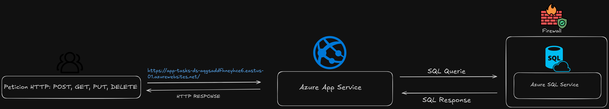

# Task Manager App

---

## 🧑‍💻 Integrantes del Equipo
- Lara V. Cordero Rodríguez - R00607366 - lcordero7366@arecibointer.edu
- Dairan S. De Jesús Mora - R00611095 - ddejesus1095@arecibointer.edu
- Ian P. Padua Cuevas -R00608377 - ipadua8377@arecibointer.edu

---

## 🎯 Descripción General
Describe brevemente tu aplicación:
- ¿Qué hace?
  El Task Manager App es una app que gestiona tareas que le provee el usuario. Donde puede crear, tachar las tareas hechas y eliminar las tareas realizadas.
- ¿A quién va dirigida?
  Esta aplición esta dirigida a usuarios como estudiantes, profesionales o personas que desean gestionar de una manera organizada y flexible.
- ¿Qué problema resuelve o qué funcionalidad ofrece?
  La aplicación está diseñada para enfrentar los desafíos relacionados con la falta de organización y el control ineficaz de tareas. Ofrece una forma clara y ordenada de gestionar actividades, optimizando el flujo de trabajo y facilitando el cumplimiento de responsabilidades diarias. 
---

## ☁️ Servicios de Azure Utilizados

| Servicio              | Propósito dentro del proyecto                                             | Gratuito en Azure for Students |
| --------------------- | ------------------------------------------------------------------------- | ------------------------------ |
| Azure App Service     | Hospedaje de la aplicación web y gestión del entorno de ejecución         | ✅ Sí                           |
| Azure SQL Database    | Almacenamiento estructurado de los datos utilizados por la app            | ✅ Sí                           |
| Azure SQL Server      | Motor de base de datos para gestionar conexiones y seguridad              | ✅ Sí                           |

--- 

## 🧱 Diagrama de Arquitectura
Agrega aquí una imagen o captura del diagrama de la infraestructura (puedes usar draw.io, Lucidchart, PowerPoint, etc.)  
Formato sugerido: PNG o JPG  
Ejemplo:

---

## ⚙️ Despliegue y Configuración

### 1. Preparación Local
Describe los pasos para instalar, correr y probar tu aplicación localmente.

### 2. Configuración en Azure
- Pasos realizados en Azure Portal
- Configuración del App Service
- Variables de entorno definidas (nombres, no valores)
- Configuración del SQL Server
- Contenedores, Blob, tablas, etc. (si aplica)

### 3. Automatización (opcional)
Si usaste GitHub Actions, Terraform, Bicep, ARM Templates, etc., explica:
- Qué automatiza
- Dónde está el archivo (.yml, .json, etc.)

---

## 💻 Enlace a la Aplicación Desplegada
> [https://tu-app.azurewebsites.net](https://tu-app.azurewebsites.net)

---

## 💸 Estimación del Costo (Azure Pricing Calculator)
Describe el costo estimado mensual de tu arquitectura si se ejecutara sin los beneficios gratuitos.  
Incluye una captura de pantalla o PDF del cálculo.  
> [Azure Pricing Calculator](https://azure.microsoft.com/en-us/pricing/calculator/)

---

## 📁 Capturas del Portal de Azure
Agrega capturas mostrando:
- Los recursos creados (App Service, SQL Database, Storage, etc.)
- Configuraciones clave
- Diagnóstico o panel de monitoreo (opcional)

---

## 📘 Lecciones Aprendidas
- ¿Qué retos enfrentaron y cómo los resolvieron?
- ¿Qué aprendieron sobre trabajar con servicios cloud?
- ¿Qué mejorarían en una próxima versión del proyecto?

---

## 📚 Repositorio del Código
Incluye el link al repositorio de GitHub (debe estar público o accesible para el profesor):
> [https://github.com/usuario/proyecto](https://github.com/usuario/proyecto)

---

## 📄 Instrucciones para Reproducir el Proyecto
1. Clonar el repositorio.
2. Instalar dependencias: `pip install -r requirements.txt` (si aplica).
3. Crear base de datos (opcional: script SQL incluido).
4. Crear variables de entorno necesarias.
5. Ejecutar la aplicación: `python app.py` o comando correspondiente.
6. Acceder desde `localhost` o mediante el App Service.

---

## ✅ Checklist Final
- [ ] App funcional y desplegada
- [ ] Servicios gratuitos utilizados correctamente
- [ ] Diagrama de arquitectura incluido
- [ ] Documentación clara y completa
- [ ] Costos estimados incluidos
- [ ] Repositorio disponible en GitHub
- [ ] Lecciones aprendidas y reflexión final escritas

---

## 🎓 Créditos
Curso: Cloud Computing  
Profesor: Javier A. Dastas  
Universidad Interamericana de Puerto Rico – Recinto de Arecibo