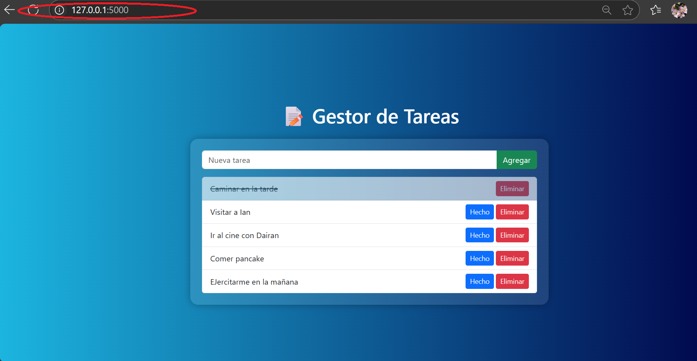

# Task Manager App

---

## 🧑‍💻 Integrantes del Equipo
- Lara V. Cordero Rodríguez - R00607366 - lcordero7366@arecibointer.edu
- Dairan S. De Jesús Mora - R00611095 - ddejesus1095@arecibointer.edu
- Ian P. Padua Cuevas -R00608377 - ipadua8377@arecibointer.edu

---

## 🎯 Descripción General
Describe brevemente tu aplicación:
- ¿Qué hace?
  El Task Manager App es una app que gestiona tareas que le provee el usuario. Donde puede crear, tachar las tareas hechas y eliminar las tareas realizadas.
- ¿A quién va dirigida?
  Esta aplición esta dirigida a usuarios como estudiantes, profesionales o personas que desean gestionar de una manera organizada y flexible.
- ¿Qué problema resuelve o qué funcionalidad ofrece?
  La aplicación está diseñada para enfrentar los desafíos relacionados con la falta de organización y el control ineficaz de tareas. Ofrece una forma clara y ordenada de gestionar actividades, optimizando el flujo de trabajo y facilitando el cumplimiento de responsabilidades diarias. 
---

## ☁️ Servicios de Azure Utilizados

| Servicio              | Propósito dentro del proyecto                                             | Gratuito en Azure for Students |
| --------------------- | ------------------------------------------------------------------------- | ------------------------------ |
| Azure App Service     | Hospedaje de la aplicación web y gestión del entorno de ejecución         | ✅ Sí                           |
| Azure SQL Database    | Almacenamiento estructurado de los datos utilizados por la app            | ✅ Sí                           |
| Azure SQL Server      | Motor de base de datos para gestionar conexiones y seguridad              | ✅ Sí                           |

--- 

## 🧱 Diagrama de Arquitectura

---

## ⚙️ Despliegue y Configuración

### 1. Preparación Local
1. Clonar el repositorio de github: https://github.com/javierdastas/comp4260
2. Configurar el entorno virtual en la terminal de Visual Studio Code `python -m venv venv`.
3. Al activar el entorno, instalas las dependencias con `pip install -r requirements.txt`.
4. Luego, configuras las variables de entorno en un `.env`
5. En la terminal de VSC se ejecuta en la terminal el comando de `python app.py`.

6. Al ejecutarse ese comando podras ver las configuraciones del "Host" y entras al puerto `http://127.0.0.1:5000`

7. Finalmente, se muestra la interfaz del Task Manager App y se nota la ruta en el browser, indicando la utilización del puerto correcto.

### 2. Configuración en Azure
- Pasos realizados en Azure Portal
- Configuración del App Service
- Variables de entorno definidas (nombres, no valores)
- Configuración del SQL Server
- Contenedores, Blob, tablas, etc. (si aplica)

### 3. Automatización (opcional)
Si usaste GitHub Actions, Terraform, Bicep, ARM Templates, etc., explica:
- Qué automatiza
- Dónde está el archivo (.yml, .json, etc.)

---

## 💻 Enlace a la Aplicación Desplegada
> [https://tu-app.azurewebsites.net](https://tu-app.azurewebsites.net)

---

## 💰 Estimación de Costo con Azure Pricing Calculator
Este proyecto utiliza los siguientes servicios de Azure:
- Azure SQL Database – Nombre del recurso: proyecto_estudiante
- Azure SQL Server – Nombre del recurso: proyecto-final-cloud

---

## 🧾 Plan Gratuito: Azure for Students
Azure for Students proporciona un crédito gratuito de $100 USD por 12 meses y acceso a múltiples servicios gratuitos, ideal para proyectos académicos.

| Servicio               | Detalles del Plan Gratuito                                                         |
| ---------------------- | ---------------------------------------------------------------------------------- |
| **Azure SQL Database** | Hasta 250 GB de almacenamiento con rendimiento básico (5 DTUs) por 12 meses        |
| **Azure SQL Server**   | Sin costo adicional cuando se usa con bases de datos incluidas en el plan gratuito |

✅ Mientras se mantenga dentro de estos límites, el uso es completamente gratuito.

---

## 📉 ¿Qué pasa si no se utiliza el plan gratuito?
Si no se cuenta con los beneficios del plan Azure for Students, los servicios se cobrarán bajo la estructura estándar de precios de Azure.

## 💡 Fórmula para estimar el costo mensual:
Costo mensual ≈ (Precio por nivel de rendimiento × Horas/mes) + (Precio por GB de almacenamiento × Almacenamiento)

---

## 📊 Escenario hipotético sin plan gratuito
Supongamos que tu aplicación es utilizada activamente por 500 usuarios mensuales, lo que requiere mayor rendimiento para manejar múltiples conexiones y transacciones concurrentes.

Configuración estimada para 500 usuarios:
- Azure SQL Database(DTU-based model)
- Plan: Standard – S1 (20 DTUs)
- Almacenamiento: 10 GB

- Tiempo en línea: 730 horas/mes (24/7)

- Precio aproximado: $30.72 USD/mes

- Azure SQL Server
  - Costo adicional: $0 USD (cuando se usa junto a SQL Database)

| Recurso                | Configuración                      | Precio estimado mensual |
| ---------------------- | ---------------------------------- | ----------------------- |
| **Azure SQL Database** | S1 – 20 DTUs, 10 GB almacenamiento | \~\$30.45 USD           |
| **Azure SQL Server**   | Usado junto a SQL Database         | \$0 USD                 |
| **Total estimado**     |                                    | **\~\$30.45 USD/mes**   |

> [Azure Pricing Calculator](ExportedEstimate.pdf)

---

## 📁 Capturas del Portal de Azure
Agrega capturas mostrando:
- Los recursos creados (App Service, SQL Database, Storage, etc.)
- Configuraciones clave
- Diagnóstico o panel de monitoreo (opcional)

---

## 📘 Lecciones Aprendidas
- ¿Qué retos enfrentaron y cómo los resolvieron?
- ¿Qué aprendieron sobre trabajar con servicios cloud?
- ¿Qué mejorarían en una próxima versión del proyecto?

---

## 📚 Repositorio del Código
Incluye el link al repositorio de GitHub (debe estar público o accesible para el profesor):
> [https://github.com/usuario/proyecto](https://github.com/usuario/proyecto)

---

## 📄 Instrucciones para Reproducir el Proyecto
1. Clonar el repositorio.
2. Instalar dependencias: `pip install -r requirements.txt` (si aplica).
3. Crear base de datos (opcional: script SQL incluido).
4. Crear variables de entorno necesarias.
5. Ejecutar la aplicación: `python app.py` o comando correspondiente.
6. Acceder desde `localhost` o mediante el App Service.

---

## ✅ Checklist Final
- [ ] App funcional y desplegada
- [ ] Servicios gratuitos utilizados correctamente
- [ ] Diagrama de arquitectura incluido
- [ ] Documentación clara y completa
- [ ] Costos estimados incluidos
- [ ] Repositorio disponible en GitHub
- [ ] Lecciones aprendidas y reflexión final escritas

---

## 🎓 Créditos
Curso: Cloud Computing  
Profesor: Javier A. Dastas  
Universidad Interamericana de Puerto Rico – Recinto de Arecibo